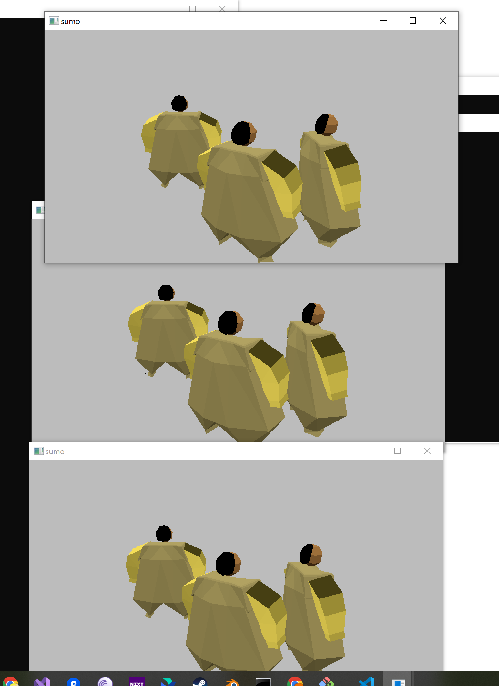

# sumo
Author: Johnny

Design: It's an ring fighting game where players play as sumo wrestlers and they move by wobbling by their feet. I don't have enough time 
to make it into a "game" but the mechanics are done and it supports however many players there could be(over LAN).

Networking: (TODO: How does your game implement client/server multiplayer? What messages are transmitted? Where in the code?)
The game's server stores the rotation and position of the players and increment rotation based on inputs. The messages sent to the server
by every client are 1, position for future implementation of collision detection, 2, the id since every client stores an unordered map of transforms of every player that isn't themselves, and since client's copy of player data gets cleared unless it's maintained by sending, I couldn't store the transforms as a member of the player struct.

Screen Shot:

How To Play:

Just wobble like a sumo wrestler

Sources: (TODO: list a source URL for any assets you did not create yourself. Make sure you have a license for the asset.)

This game was built with [NEST](NEST.md).

